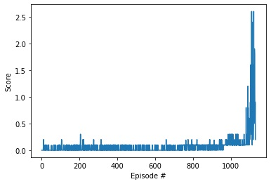

<h1 align="center">
  <br>
  <a href="https://github.com/VinBots/Multi-Agent_Soft_Actor_Critic"></a>
</h1>

<h4 align="center">Multi-Agent Collaboration through Reinforcement Learning </h4>
<p align="center">
  <a href="#about">About</a> •
  <a href="#learning">Learning</a> •
  <a href="#installation">Installation</a> •
  <a href="#configuration">Configuration</a> •
  <a href="#references">References</a> •
  <a href="#credits">Credits</a> •
  <a href="#going-further">Going Further</a>
</p>

---
<h1 align="center">
  <br>
  <a href="https://github.com/VinBots/world_models"></a>
</h1>
<h5 align="center">Collaboration: 2 agents controlling rackets to bounce a ball over a net</h2>

## About

This is an implementation of a Multi-Agent Soft Actor-Critic (MASAC) algorithm where critics are trained centrally but execution of actors is distributed.

In this environment, two agents control rackets to bounce a ball over a net. If an agent hits the ball over the net, it receives a reward of +0.1.  If an agent lets a ball hit the ground or hits the ball out of bounds, it receives a reward of -0.01.  Thus, the goal of each agent is to keep the ball in play.

The observation space consists of 8 variables corresponding to the position and velocity of the ball and racket. Each agent receives its own, local observation.  Two continuous actions are available, corresponding to movement toward (or away from) the net, and jumping. 

The task is episodic, and in order to solve the environment, the agents must get an average score of +0.5 (over 100 consecutive episodes, after taking the maximum over both agents). Specifically,

- After each episode, we add up the rewards that each agent received (without discounting), to get a score for each agent. This yields 2 (potentially different) scores. We then take the maximum of these 2 scores.
- This yields a single **score** for each episode.

The environment is considered solved, when the average (over 100 episodes) of those **scores** is at least +0.5.

## Learning
* Multi-Agent collaboration environment
* Soft Actor-Critic algorithm

### Results




## Installation

**1. Download the environment**

Download the environment from one of the links below. Then, unzip (or decompress) the file. You need only select the environment that matches your operating system:

    - Linux: [click here](https://s3-us-west-1.amazonaws.com/udacity-drlnd/P3/Tennis/Tennis_Linux.zip)
    - Mac OSX: [click here](https://s3-us-west-1.amazonaws.com/udacity-drlnd/P3/Tennis/Tennis.app.zip)
    - Windows (32-bit): [click here](https://s3-us-west-1.amazonaws.com/udacity-drlnd/P3/Tennis/Tennis_Windows_x86.zip)
    - Windows (64-bit): [click here](https://s3-us-west-1.amazonaws.com/udacity-drlnd/P3/Tennis/Tennis_Windows_x86_64.zip)
    
    (_For Windows users_) Check out [this link](https://support.microsoft.com/en-us/help/827218/how-to-determine-whether-a-computer-is-running-a-32-bit-version-or-64) if you need help with determining if your computer is running a 32-bit version or 64-bit version of the Windows operating system.

    (_For AWS_) If you'd like to train the agent on AWS (and have not [enabled a virtual screen](https://github.com/Unity-Technologies/ml-agents/blob/master/docs/Training-on-Amazon-Web-Service.md)), then please use [this link](https://s3-us-west-1.amazonaws.com/udacity-drlnd/P3/Tennis/Tennis_Linux_NoVis.zip) to obtain the "headless" version of the environment.  You will **not** be able to watch the agent without enabling a virtual screen, but you will be able to train the agent.  (_To watch the agent, you should follow the instructions to [enable a virtual screen](https://github.com/Unity-Technologies/ml-agents/blob/master/docs/Training-on-Amazon-Web-Service.md), and then download the environment for the **Linux** operating system above._)
 

**2. Clone the repository**

```
git clone https://github.com/VinBots/Multi-Agent_Soft_Actor_Critic.git
```

**3. Create and activate a new virtual environment via conda**

```
conda create --name new_env python=3.6.13
conda activate new_env
```

**4. Install the required packages**

Go to the root directory and install the dependencies
```
cd Multi-Agent_Soft_Actor_Critic
pip install -r requirements.txt
```
**4. Run the algorithm**

Open Jupyter Notebook and run `src/MASAC_modular.ipynb`

## Configuration

Follow the instructions in `src/MASAC_modular.ipynb`

## References

* Soft Actor-Critic: Off-Policy Maximum Entropy Deep Reinforcement Learning with a Stochastic Actor, Haarnoja et al, 2018
* Soft Actor-Critic Algorithms and Applications, Haarnoja et al, 2018
* Learning to Walk via Deep Reinforcement Learning, Haarnoja et al, 2018
* [Open AI](https://spinningup.openai.com/en/latest/algorithms/sac.html)
* [Soft Learning Repo](https://github.com/rail-berkeley/softlearning)


## Credits

* Udacity Deep Reinforcement Learning NanoDegree (DRLND)  Program


## Going Further

* TBC [work in progress]