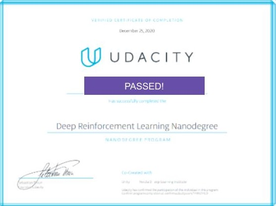

[//]: # (Image References)

[image1]: https://user-images.githubusercontent.com/10624937/42135602-b0335606-7d12-11e8-8689-dd1cf9fa11a9.gif "Trained Agents"


[image2]: https://user-images.githubusercontent.com/10624937/42386929-76f671f0-8106-11e8-9376-f17da2ae852e.png "Kernel"


<h1 align="center">
  <br>
  <a href="https://github.com/VinBots/"></a>
</h1>

<h4 align="center">Initiation to Deep Reinforcement Learning </h4>
<p align="center">
  <a href="#about">About</a> •
  <a href="#learning">Learning</a> •
  <a href="#installation">Installation</a> •
  <a href="#configuration">Configuration</a> •
  <a href="#references">References</a> •
  <a href="#credits">Credits</a> •
  <a href="#going-further">Going Further</a>
</p>

---
<h1 align="center">
  <br>
  <a href=""></a>
</h1>
<h5 align="center">A suite of Deep RL tasks in Unity / Gym environments</h2>


## About

This repository includes:

### 3 projects

* [Navigation](https://github.com/VinBots/deep-reinforcement-learning/tree/master/p1_navigation): xxx
* [Continuous Control](https://github.com/VinBots/deep-reinforcement-learning/tree/master/p2_continuous-control): xxx
* [Collaboration and Competition](https://github.com/VinBots/deep-reinforcement-learning/tree/master/p3_collab-compet): xxx 

### A suite of tutorials for various algorithms in reinforcement learning.  

* [Dynamic Programming](https://github.com/udacity/deep-reinforcement-learning/tree/master/dynamic-programming): Implement Dynamic Programming algorithms such as Policy Evaluation, Policy Improvement, Policy Iteration, and Value Iteration. 
* [Monte Carlo](https://github.com/udacity/deep-reinforcement-learning/tree/master/monte-carlo): Implement Monte Carlo methods for prediction and control. 
* [Temporal-Difference](https://github.com/udacity/deep-reinforcement-learning/tree/master/temporal-difference): Implement Temporal-Difference methods such as Sarsa, Q-Learning, and Expected Sarsa. 
* [Discretization](https://github.com/udacity/deep-reinforcement-learning/tree/master/discretization): Learn how to discretize continuous state spaces, and solve the Mountain Car environment.
* [Tile Coding](https://github.com/udacity/deep-reinforcement-learning/tree/master/tile-coding): Implement a method for discretizing continuous state spaces that enables better generalization.
* [Deep Q-Network](https://github.com/udacity/deep-reinforcement-learning/tree/master/dqn): Explore how to use a Deep Q-Network (DQN) to navigate a space vehicle without crashing.
* [Robotics](https://github.com/dusty-nv/jetson-reinforcement): Use a C++ API to train reinforcement learning agents from virtual robotic simulation in 3D. (_External link_)
* [Hill Climbing](https://github.com/udacity/deep-reinforcement-learning/tree/master/hill-climbing): Use hill climbing with adaptive noise scaling to balance a pole on a moving cart.
* [Cross-Entropy Method](https://github.com/udacity/deep-reinforcement-learning/tree/master/cross-entropy): Use the cross-entropy method to train a car to navigate a steep hill.
* [REINFORCE](https://github.com/udacity/deep-reinforcement-learning/tree/master/reinforce): Learn how to use Monte Carlo Policy Gradients to solve a classic control task.
* **Proximal Policy Optimization**: Explore how to use Proximal Policy Optimization (PPO) to solve a classic reinforcement learning task. (_Coming soon!_)
* **Deep Deterministic Policy Gradients**: Explore how to use Deep Deterministic Policy Gradients (DDPG) with OpenAI Gym environments.
  * [Pendulum](https://github.com/udacity/deep-reinforcement-learning/tree/master/ddpg-pendulum): Use OpenAI Gym's Pendulum environment.
  * [BipedalWalker](https://github.com/udacity/deep-reinforcement-learning/tree/master/ddpg-bipedal): Use OpenAI Gym's BipedalWalker environment.
* [Finance](https://github.com/udacity/deep-reinforcement-learning/tree/master/finance): Train an agent to discover optimal trading strategies.

## Learning
* General deep RL algorithms
* Multi-Agent collaboration environment
* Soft Actor-Critic algorithm

## Installation

To set up your python environment to run the code in this repository, follow the instructions below.

1. Create (and activate) a new environment with Python 3.6.

	- __Linux__ or __Mac__: 
	```bash
	conda create --name drlnd python=3.6
	source activate drlnd
	```
	- __Windows__: 
	```bash
	conda create --name drlnd python=3.6 
	activate drlnd
	```
	
2. [Only for tutorials] Follow the instructions in [this repository](https://github.com/openai/gym) to perform a minimal install of OpenAI gym.  
	- Next, install the **classic control** environment group by following the instructions [here](https://github.com/openai/gym#classic-control).
	- Then, install the **box2d** environment group by following the instructions [here](https://github.com/openai/gym#box2d).
	
3. Clone the repository and navigate to the `python/` folder.  Then, install several dependencies.
```bash
git clone https://github.com/udacity/deep-reinforcement-learning.git
cd deep-reinforcement-learning/python
pip install .
```
In case Pytorch fails to be installed, try `pip install torch==0.4.1 -f https://download.pytorch.org/whl/torch_stable.html`

4. Create an [IPython kernel](http://ipython.readthedocs.io/en/stable/install/kernel_install.html) for the `drlnd` environment.  
```bash
python -m ipykernel install --user --name drlnd --display-name "drlnd"
```

5. Before running code in a notebook, change the kernel to match the `drlnd` environment by using the drop-down `Kernel` menu. 

![Kernel][image2]

All of the code is in PyTorch (v0.4) and Python 3.

## Configuration

Follow the instructions described in the README of each project

## References

* David Silver
* Sutton Barto


## Credits

* Udacity [Deep Reinforcement Learning Nanodegree](https://www.udacity.com/course/deep-reinforcement-learning-nanodegree--nd893) program.  

## Going Further

* Implementation of Alpha Go Zero / Alpha Zero
* Implementation of new algorithm (e.g. to solve the car racing gym environment)