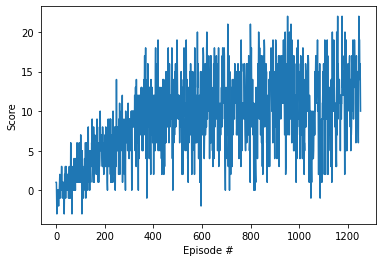
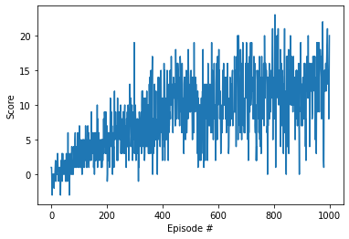
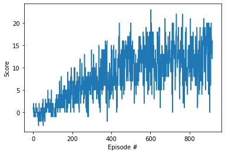
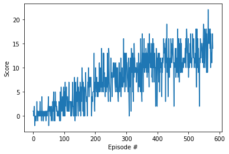
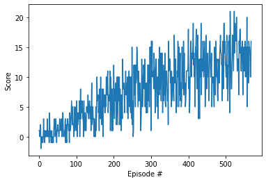

[//]: # (Image References)

[image1]: https://user-images.githubusercontent.com/10624937/42135619-d90f2f28-7d12-11e8-8823-82b970a54d7e.gif "Trained Agent"

# Project 1: Navigation

## Introduction

For this project, we  train an agent to navigate and collect bananas in a large, square world.

![Trained Agent][image1]

A reward of +1 is provided for collecting a yellow banana, and a reward of -1 is provided for collecting a blue banana.  Thus, the goal of the agent is to collect as many yellow bananas as possible while avoiding blue bananas. 

The state space has 37 dimensions and contains the agent's velocity, along with ray-based perception of objects around agent's forward direction.  Given this information, the agent has to learn how to best select actions.  Four discrete actions are available, corresponding to:
- **`0`** - move forward.
- **`1`** - move backward.
- **`2`** - turn left.
- **`3`** - turn right.

The task is episodic, and in order to solve the environment, your agent must get an average score of +13 over 100 consecutive episodes.
The agent will not use specific knowledge about the meaning of the observations (e.g. velocity) provided by the environment.


## Installation

### Dependencies

This repository contains material related to Udacity's [Deep Reinforcement Learning Nanodegree](https://www.udacity.com/course/deep-reinforcement-learning-nanodegree--nd893) program.  All of the code is in PyTorch (v0.4) and Python 3.

To set up your python environment to run the code in this repository, follow the instructions below.

1. Create (and activate) a new environment with Python 3.6.

	- __Linux__ or __Mac__: 
	```bash
	conda create --name drlnd python=3.6
	source activate drlnd
	```
	- __Windows__: 
	```bash
	conda create --name drlnd python=3.6 
	activate drlnd
	```
	
2. Follow the instructions in [this repository](https://github.com/openai/gym) to perform a minimal install of OpenAI gym.  
	- Next, install the **classic control** environment group by following the instructions [here](https://github.com/openai/gym#classic-control).
	- Then, install the **box2d** environment group by following the instructions [here](https://github.com/openai/gym#box2d).
	
3. Clone the repository, and navigate to the `python/` folder.  Then, install several dependencies.
```bash
git clone https://github.com/udacity/deep-reinforcement-learning.git
cd deep-reinforcement-learning/python
pip install .
```

4. Create an [IPython kernel](http://ipython.readthedocs.io/en/stable/install/kernel_install.html) for the `drlnd` environment.  
```bash
python -m ipykernel install --user --name drlnd --display-name "drlnd"
```

5. Before running code in a notebook, change the kernel to match the `drlnd` environment by using the drop-down `Kernel` menu. 

### Environment
1. Download the environment from one of the links below.  You need only select the environment that matches your operating system:
    - Linux: [click here](https://s3-us-west-1.amazonaws.com/udacity-drlnd/P1/Banana/Banana_Linux.zip)
    - Mac OSX: [click here](https://s3-us-west-1.amazonaws.com/udacity-drlnd/P1/Banana/Banana.app.zip)
    - Windows (32-bit): [click here](https://s3-us-west-1.amazonaws.com/udacity-drlnd/P1/Banana/Banana_Windows_x86.zip)
    - Windows (64-bit): [click here](https://s3-us-west-1.amazonaws.com/udacity-drlnd/P1/Banana/Banana_Windows_x86_64.zip) 
    
    (_For Windows users_) Check out [this link](https://support.microsoft.com/en-us/help/827218/how-to-determine-whether-a-computer-is-running-a-32-bit-version-or-64) if you need help with determining if your computer is running a 32-bit version or 64-bit version of the Windows operating system.

    (_For AWS_) If you'd like to train the agent on AWS (and have not [enabled a virtual screen](https://github.com/Unity-Technologies/ml-agents/blob/master/docs/Training-on-Amazon-Web-Service.md)), then please use [this link](https://s3-us-west-1.amazonaws.com/udacity-drlnd/P1/Banana/Banana_Linux_NoVis.zip) to obtain the environment.

2. Place the file in the DRLND GitHub repository, in the `p1_navigation/` folder, and unzip (or decompress) the file. 

Follow the instructions in `Navigation.ipynb` to get started with training your own agent!  

## Algorithm Description

I adapted the DQN (Deep Q-Learning Network) algorithm described in the research paper [Human-level control through deep reinforcement learning](https://storage.googleapis.com/deepmind-media/dqn/DQNNaturePaper.pdf).
Some features were not implemented like reward clipping or the use of a convolutional network (I used a simple neural network with 2 fully-connected layers.

DQN belongs to the family of Q-Learning (also called SARSAMAX) algorithm, which is an off-policy algorithm (because we evaluate target policy $\pi(a/s)$ to compute $v_{\pi}(s)$ or $q_{\pi}(s,a)$ while following behaviour policy $\mu(a/s)$). 


* the target policy is greedy w.r.t. Q(s,a) with $\pi_{S_{t+1}} = \underset{a'}{argmax}Q(S_{t+1}, a')$
* the behavior policy $\mu$ is $\epsilon$-greedy w.r.t. Q(s,a)
* the Q-learning target is $R_{t+1} + \max_{a'}\gamma Q(S_{t+1},a')$

DQN uses a neural network as the Q-value function approximator. In the final version, the neural network is made of 2 fully connected layers of 64 neurons with ReLU activation at each layer. The input is made of 37 states and the output is the set of estimated Q-values for each state-action pair.

DQN also uses 2 specific techniques:

* **experience replay**: When the agent interacts with the environment, the sequence of experience tuples can be highly correlated. The naive Q-learning algorithm that learns from each of these experience tuples in sequential order runs the risk of getting swayed by the effects of this correlation. By instead keeping track of a replay buffer and using experience replay to sample from the buffer at random, we can prevent action values from oscillating or diverging catastrophically. The replay buffer contains a collection of experience tuples (S,A,R,S'). The tuples are gradually added to the buffer as we are interacting with the environment. The act of sampling a small batch of tuples from the replay buffer in order to learn is known as experience replay. In addition to breaking harmful correlations, experience replay allows us to learn more from individual tuples multiple times, recall rare occurrences, and in general make better use of our experience.
* **fixed Q-targets (fixed parameters)**: In Q-Learning, we update a guess with a guess, and this can potentially lead to harmful correlations. To avoid this, we can update the parameters to better approximate the action value corresponding to state S and action A with the following update rule:


where $w^-$ are the weights of a separate target network that are not changed during the learning step, and (S,A,R,S') is an experience tuple.


## Tests Results

Many tests were performed to optimize the efficiency of the algorithm. The best performance was obtained in test 13 with the hyperparameters referenced below.
The model of test 13 can be found in the main folder (file checkpoint.pth).

I noted a few interesting take-aways:

* "simple is better" - we can see that a more complex and deeper neural network is not efficient and tends to diverge. Dropouts did not improve the neural network.
* a large buffer significantly improves the learning of the algorithm
* a gradual decay of the learning rate and soft update parameter TAU improved the learning too
* batch size of 32 seems optimal - a lower or higher size did not show improvements


|Hyperparameters|Test 1| Test 2 | Test 3 |Test 4|Test 5|Test 6|Test 7|Test 8|Test 9|Test 10|Test 11|Test 12|Test13|
|---|---|---|---|---|---|---|---|---|---|---|---|---|---|
|History|1|=|=|=|=|=|=|=|=|=|=|=|=|
|FC1|128|256|128|=|=|dropout 0.5| dropout 0.25|No Dropout|=|64|32|64|=|
|FC2|128|256|128|=|=|dropout = 0.5| dropout 0.25|No Dropout|=|64|32|64|=|
|BUFFER_SIZE|1e3|=|=|=|=|=|=|=|=|=|=|1e4|1e5|
|BATCH_SIZE| = 32|=|=|=|=|=|=|128|16|32|32|=|=|
|GAMMA| = 0.99|=|=|=|=|=|=|=|=|=|=|=|=|
|TAU| = 1e-3|=|=|-50% / 500ep|-10%/100ep|=|=|=|=|=|=|=|=|
|LR| = 1e-3|-50%/500ep|=|=|-10%/100ep|=|=|=|=|=|=|=|=|
|UPDATE_EVERY| = 4|=|=|=|=|=|=|=|=|=|=|=|=|
|n_episodes|=1000|=|=|=|=|=|=|=|=|=|=|=|=|
|max_t|=500|=|=|=|=|=|=|=|=|=|=|=|=|
|eps_start|=1.0|=|=|=|=|=|=|=|=|=|=|=|=|
|eps_end|=0.01|=|=|=|=|=|=|=|=|=|=|=|=|
|eps_decay|=0.995|=|=|=|=|=|=|=|=|=|=|=|=|
|Average Score per 100 epsiodes|
|Episode 100|1.16|1.02|1.16|1.16|1.16|-0.03|0.32|0.40|0.64|0.41|0.50|1.05|1.22
|Episode 200| 3.81|2.84|3.81|3.81|3.77|0.931|2.07|1.17|3.74|2.74|3.40|4.07|4.54
|Episode 300| 5.68|4.73|5.68|5.68|6.00|2.2|5.97|3.54|6.00|5.34|5.55|7.69|7.67
|Episode 400| 9.16|6.63|9.16|9.16|7.45|3.98|9.30|5.23|8.77|7.53|7.75|9.956|9.78
|Episode 500| 10.30|7.67|10.3|10.30|10.65|6.52|10.42|5.78|9.51|10.17|9.84|11.71|11.82
|Episode 600| 10.07|8.2|10.07|9.423|9.43|7.48|10.54|6.46|10.71|11.30|9.31|**13.02**|**13.05**
|Episode 700| 10.82|9.02|10.82|10.94|11.12|8.76|9.287|6.72|9.71|11.43|10.10|
|Episode 800| 11.69|8.16|11.69|10.36|11.85|7.63|10.88|7.33|10.68|11.86|11.75|
|Episode 900| 10.96|8.62|10.96|11.15|12.31|8.81|10.16|7.13|11.10|12.64|11.89|
|Episode 1000|**10.15**|**8.46**|**10.15**|12.26|**13.04**|**8.20**|**10.27**|**4.11**|**10.75**|**13.00**|**12.40**|
|Episode 1100||||9.605|||||||
|Episode 1200||||11.43
|Episode 1253||||**13.03**
|Episode 2000|||**12.73**

Note: the scores in bold represent the score recorded at the end of the test (usually stopped after 1000 episodes, or after reaching 13 on average over the last 100 episodes)

### Test 4


### Test 5


### Test 10


### Test 12


### Test 13 (best performance - environment solved in 469 episodes)



## Future Improvements

We should now implement the extensions to the Deep Q-Networks (DQN) algorithm:

* Double DQN (DDQN)
* Prioritized experience replay
* Dueling DQN
* Learning from multi-step bootstrap targets (as in A3C - you'll learn about this in the next part of the nanodegree)
* Distributional DQN
* Noisy DQN

In the project, the agent learned from information such as its velocity, along with ray-based perception of objects around its forward direction. A more challenging task would be to learn directly from pixels and use a convolutional network as in the [DQN paper](https://storage.googleapis.com/deepmind-media/dqn/DQNNaturePaper.pdf)

