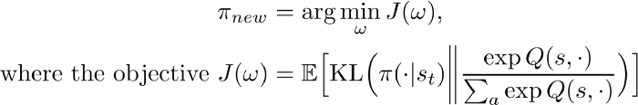
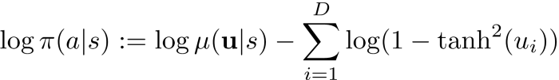
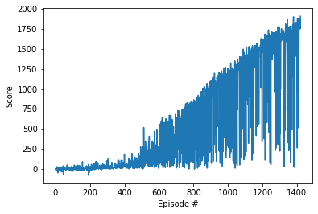

<h1 align="center" style="background-color:Gray;">

   
  
</h1>

<h4 align="center">Soft Actor Critic Model for Continuous Control </h4>

  <a href="#about">About</a> •
  <a href="#results">Results</a> •
  <a href="#installation">Installation</a> •
  <a href="#configuration">Configuration</a> •
  <a href="#references">References</a> •
  <a href="#credits">Credits</a> •
  <a href="#going-further">Going Further</a>

---

<h1 align="center">
   
  
</h1>
<h5 align="center"> A double-jointed arm moving to target locations.</h2>

## About

This repository includes an implementation of the  SAC (Soft Actor-Critic) algorithm that proves to be more efficient and robust than many deterministic approaches (like DDPG). SAC is also addressing the sample complexity issue: off-policy methods are more sample-efficient, as long as we can keep policy updates within an acceptable range, like in Trust Region Policy Optimization [TRPO] or Proximal Policy Optimization [PPO] methods.

### Soft Actor-Critic (SAC) Algorithm

#### Description of SAC

* SAC is an off-policy actor-critic algorithm based on the maximum entropy RL framework

The maximum entropy objective has a number of conceptual and practical advantages. First, the policy is incentivized to explore more widely, while giving up on clearly unpromising avenues. Second, the policy can capture multiple modes of near-optimal behavior. In problem settings where multiple actions seem equally attractive, the policy will commit equal probability mass to those actions. In practice, we observe improved exploration with this objective

* The actor aims to simultaneously maximize expected return and entropy
We extend SAC to incorporate a number of modifications that accelerate training and improve stability with respect to the hyperparameters, including a constrained formulation that automatically tunes the temperature hyperparameter.

Our soft actor-critic algorithm incorporates **three key ingredients**: 

1. an actor-critic architecture with separate policy and value function networks
2. an off-policy formulation that enables reuse of previously collected data for efficiency 
3. entropy maximization to encourage stability and exploration.

SAC is a loop of policy evaluation through Q-value updates of the critic (based on the modified objective including the entropy term) and policy improvement updates (actor). This loop is called a policy iteration.

#### Policy Evaluation - soft Q-Update

We apply the Bellman operator, augmented by an entropy term

$$T^{\pi}Q(s_t,a_t) = r(s_t,a_t) + \gamma \mathbb E_{s_{t+1}->p}[V(s_{t+1}] $$

where

$$V(s_t) = \mathbb E_{a_t -> \pi} [Q(s_t,a_t) - \alpha.log \pi(a_t,s_t)] $$

We define the following objective policy;

Alpha term represents the "entropy temperature," i.e. how much we weight the "randomness" of our policy versus the environment reward.

Alpha can be tuned automatically. Alpha varies according to the magnitude of the rewards (different by task but also during training. Instead of tuning the temperature manually, we treat it as a constraint by setting a target temperature (another hyperparameter though!). "Our aim is to find a stochastic policy with maximal expected return that satisfies a minimum expected entropy constraint" See page 7 of the paper.

#### Policy Improvement

We update the policy distribution towards the softmax distribution for the current Q function. We want to minimize the distance (“divergence”) between the two distributions. This is accomplished by minimizing the Kullback-Leibler (KL) divergence between the two distributions:

Haarnoja et al. uses the “re-parameterization trick” on the policy output to get a low variance estimator; in particular, we represent the actions as the hyperbolic tangent (tanh) applied to z-values sampled from the mean and log standard deviation outputted by the policy neural network.

**Step by step:**

* We do a forward pass on our network to convert a state into the mean, log std of a state
* We sample an action from a normal distribution parameterized by mean, std
* We squeeze the action value between -1 and 1 with Tanh
* We calculate log_pi (see formula below)

Explanations from the paper: we apply an invertible squashing function (tanh) to the Gaussian samples, and employ the change of variables formula to compute the likelihoods of the bounded actions. In the other words, let u ∈ $R^D$ be a random variable and μ(u|s) the corresponding density with infinite support. Then a = tanh(u), where tanh is applied elementwise, is a random variable with support in (−1, 1).

## Results

### Network parameters 

After (too) many trials, I opted for the following hyperparameters and network parameters. I also looked at the influence of the double Q network minimum trick. See results below.

Note that:

* I started training after running 10 epochs so that enough experiences (10,000) are stored, which prevents the policy from over-specializing on a low number of sampled experiences.

* Many hyperparameters are very sensitive to tune (like soft update, learning rates, log std ranges)

The optimal buffer size is around 50,000, i.e. about 5 times less than the number of experiences used for training per epoch (1000 times batches of 256 experiences, i.e. 256,000 sampled experiences per epoch). 

The networks have the following architecture:

|Networks|Q (critic)|Policy (actor)|
|---|---|---|---|---|
|Input|state,action = 33 + 4|state = 33|
|Fully connected Layers|128x2| 128x2|
|Output|1 {Q(s,a)}|2 {mean,log std} of $\pi(s)$|

### Results 

|Hyperparameters|Standard SAC (2019 version)|
|---|---|
|Replay Buffer size|50,000|
|Batch size|256|=|=|=|
|Soft Target Tau|0.02|
|Temperature (alpha)|Auto|
|Learning Rate - actor|0.0003 +/0.0002|=|=|=|=|
|Learning Rate - critic|0.0005 +/0.0005|=|=|=|=|
|Learning Rate - temperature|0.0005 +/0.0005|
|**RESULTS**|
|Solved Episodes|Best score = 20|

Here's the learning curves of the tests:

Note that evaluation should be done after removing stochasticity of the action choice, as in the get_action2 function (in the notebook, set train_mode = False and load_mode = True and run the entire notebook).

The charts below were recorded during training mode.

**Standard SAC with temperature auto-tuning**

.png )

**SAC with a single soft Q-function**

.png)

#### Crawler Environment

I also implemented the SAC algorithm for the Crawler environment. After a couple of hours of training and very few changes in hyperparameters, the game was solved, which is quite remarkable!

See performance below.

Note that the evaluation should be done by removing stochasticity of the action choice, as in the get_action2 function.

The learning curve is as below:

## Installation

Please refer to README of the repository and instructions for installing the Reacher and Crawler environments in [env_install.md](env_install.md)

## Configuration

All the parameters are located in `src/Continuous_Control-SAC-Reacher.ipynb`

## References

* Original paper [here](https://arxiv.org/pdf/1812.05905.pdf)
* [Berkeley implementation](https://github.com/rail-berkeley/softlearning)
* [Medium](https://towardsdatascience.com/in-depth-review-of-soft-actor-critic-91448aba63d4)
* [OpenAI - Spinning Up](https://spinningup.openai.com/en/latest/algorithms/sac.html)

## Credits

* Udacity [Deep Reinforcement Learning Nanodegree](https://www.udacity.com/course/deep-reinforcement-learning-nanodegree--nd893) program.  

## Going Further

Here's a few ideas to explore to improve the current algorithm:

* sample experiences in a more efficient way, e.g. prioritized replay from a continuous space.
* adjust the soft update according to the certainty of the network (low standard deviation of the policy should lead to more stability)
* teach a new network with a pre-filled buffer of positive experiences from the beginning
* introduce a target network for the actor
